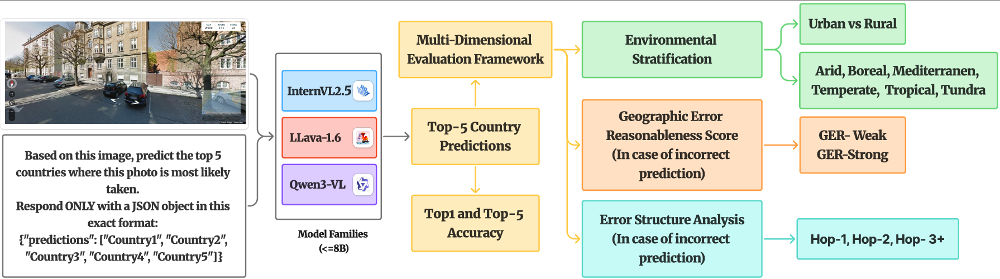
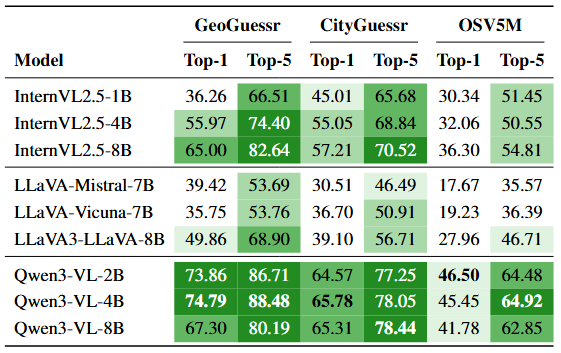
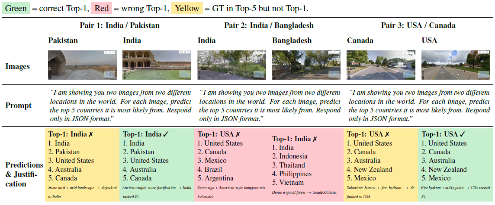

<h1 align="center">
🌎 Where Do Vision-Language Models Fail? <br>
World Scale Analysis for Image Geolocalization
</h1>

<p align="center">
  <a href="[https://arxiv.org/abs/2604.16248](https://arxiv.org/abs/2604.16248)">
    
  </a>
</p>


## 📌 Abstract

Image geolocalization has traditionally been addressed through retrieval-based place recognition or geometry-based visual localization pipelines. Recent advances in Vision-Language Models (VLMs) have demonstrated strong zero-shot reasoning capabilities across multimodal tasks, yet their performance in geographic inference remains underexplored. In this work, we present a systematic benchmark of multiple state-of-the-art VLMs for country-level image geolocalization using ground-view imagery only. Instead of relying on image matching, GPS metadata, or task-specific training, we evaluate prompt-based country prediction in a zero-shot setting. The selected models are tested on three geographically diverse datasets to assess their robustness and generalization ability. Our results reveal substantial variation across models, highlighting the potential of semantic reasoning for coarse geolocalization and the limitations of current VLMs in capturing fine-grained geographic cues. This study provides the first focused comparison of modern VLMs for country-level geolocalization and establishes a foundation for future research at the intersection of multimodal reasoning and geographic understanding.

---

## 🎯 Key Contributions

* ✅ **Unified Benchmark** for evaluating VLMs on geolocalization
* 📊 Introduction of **Geographic Error Reasonableness (GER)**
* 🔍 Deep analysis of:

  * urban vs rural performance
  * biome-based difficulty
  * geographic error patterns

---

## 🧠 Problem Setting

Given an input image, the model predicts:

```json
{
  "predictions": ["Country1", "Country2", "Country3", "Country4", "Country5"]
}
```
---
## 🚀 Overview of the evaluation pipeline

<p align="center">
  <br>
  <em>Figure 1: Evaluation pipeline of the proposed framework</em>
</p>

A ground-level image and a structured prompt are passed to each of the three VLM families (8B parameters), which output Top-5 country predictions. Performance is assessed via Top-1/Top-5 accuracy and a multi-dimensional evaluation framework comprising Environmental Stratification (urban/rural and six biome categories), Error Structure Analysis (neighbor hop distance), and Geographic Error Reasonableness (GER) score, the latter two applied only to incorrect predictions.

---
### Two evaluation modes:

* **Unconstrained** → free-form prediction
* **Label-constrained** → choose from predefined country list

---

## 🏗️ Models Evaluated

We benchmark **9 state-of-the-art VLMs**:

### 🔹 InternVL Family

* InternVL2.5-1B
* InternVL2.5-4B
* InternVL2.5-8B

### 🔹 LLaVA Family

* LLaVA-Mistral-7B
* LLaVA-Vicuna-7B
* LLaMA3-LLaVA-NeXT-8B

### 🔹 Qwen3-VL Family

* Qwen3-VL-2B
* Qwen3-VL-4B ⭐ (best overall)
* Qwen3-VL-8B

---

## 📊 Datasets

| Dataset        | Images | Countries | Source             |
| -------------- | ------ | --------- | ------------------ |
| GeoGuessr-50k  | ~50K   | 124       | Google Street View |
| CityGuessr     | ~68K   | 91        | YouTube            |
| OSV5M (subset) | 50K    | 219       | Mapillary          |


---
## 📈 Results


<p align="left">
  <br>
  <em>Figure 2: Geolocalization accuracy. Top-1 / Top-5 accuracy (%) across all three benchmarks.</em>
</p>

---
<p align="left">
  <br>
  <em>Figure 3: Neighbouring country confusion analysis using Qwen3-VL-4B-Instruct in a blind two-turn setting (Turn 1: predict; Turn 2:
justify).</em>
</p>
---


## 📚 Citation

```bibtex
@misc{bharadwaj2026visionlanguagemodelsfailworld,
      title={Where Do Vision-Language Models Fail? World Scale Analysis for Image Geolocalization}, 
      author={Siddhant Bharadwaj and Ashish Vashist and Fahimul Aleem and Shruti Vyas},
      year={2026},
      eprint={2604.16248},
      archivePrefix={arXiv},
      primaryClass={cs.CV},
      url={https://arxiv.org/abs/2604.16248}, 
}
```

---

## 🙌 Acknowledgements


---

## 📬 Contact

For questions or collaboration:

* Open an issue
* Or reach out via email


